# Reto 2 UX 

## Objetivo
Identifica los elementos de navegación en los siguientes sites
* Breather
* Github
* Medium
---
1. Identificando Elementos de Navegación de :

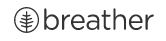

###  Navegación Global

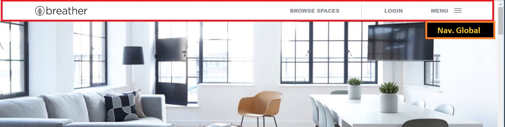

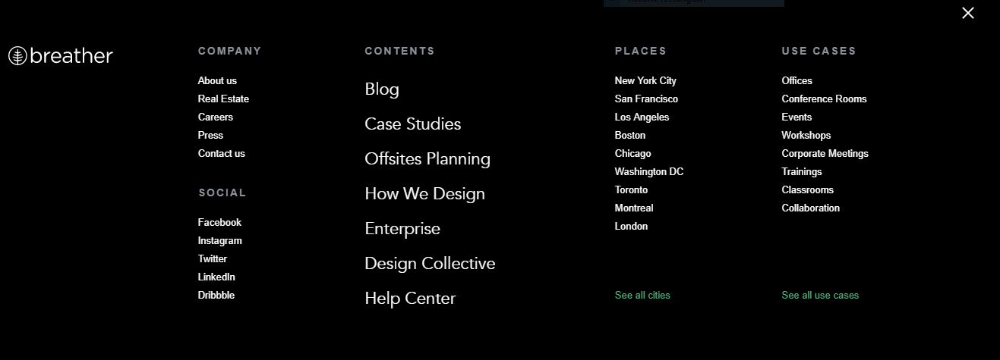

###  Navegación Facetada 

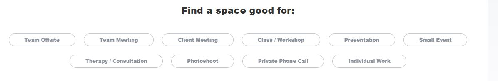
###  Navegación Filtrada

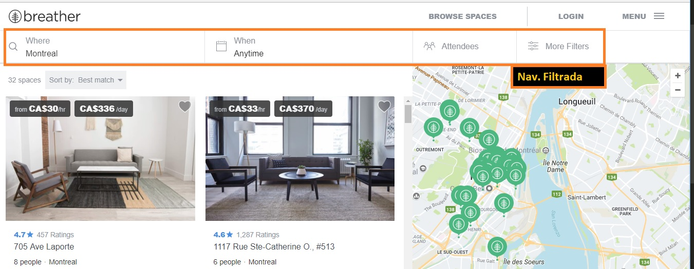

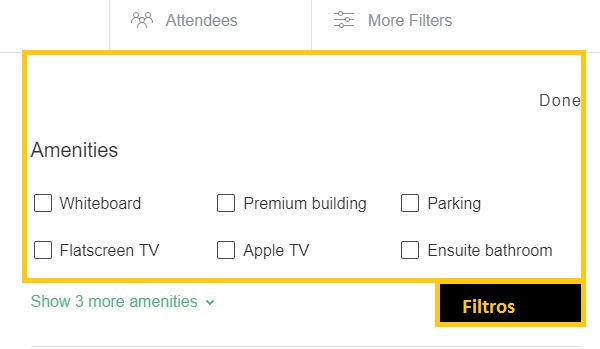

---
2. Identificando Elementos de Navegación de :

### Navegación Global
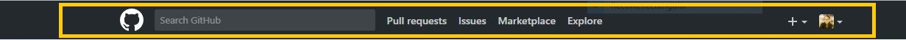
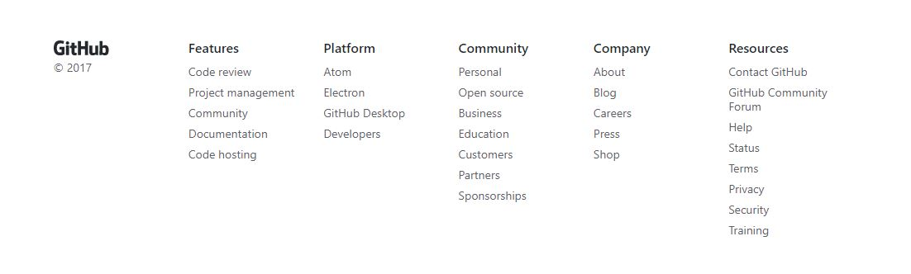
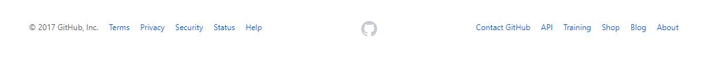

### Navegación Local
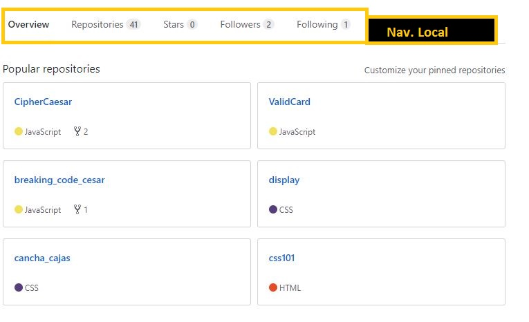
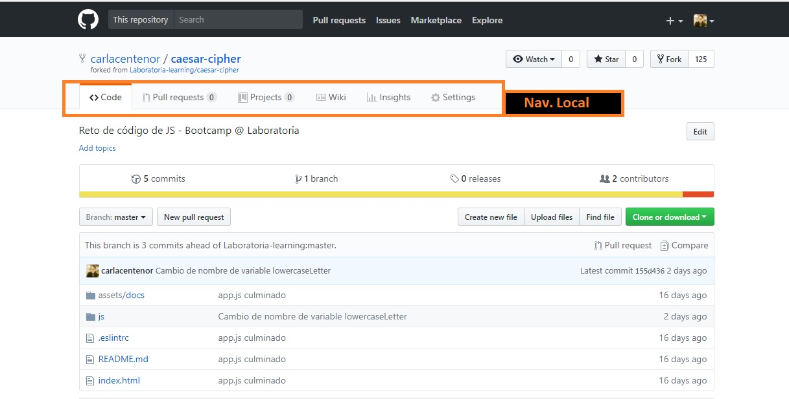
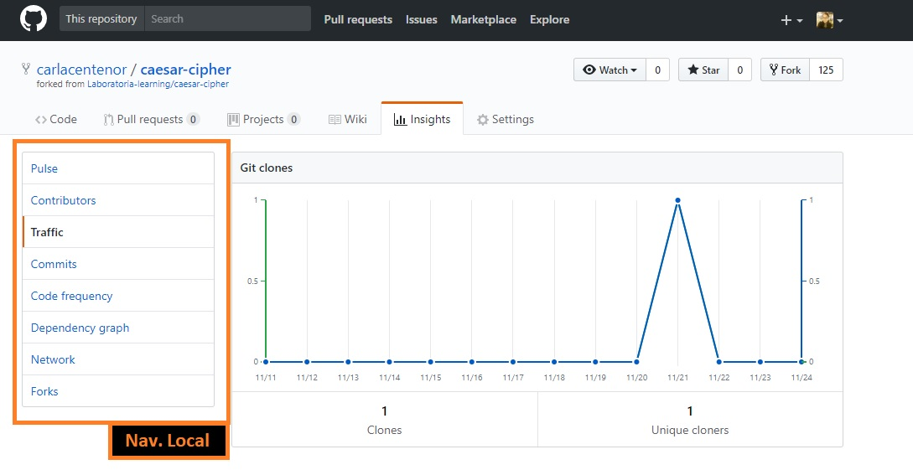
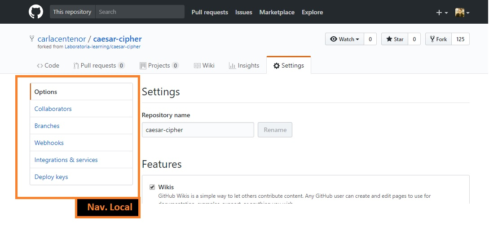
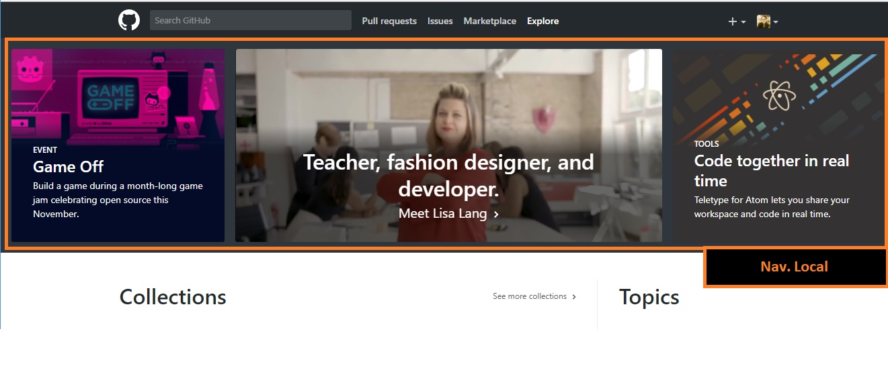
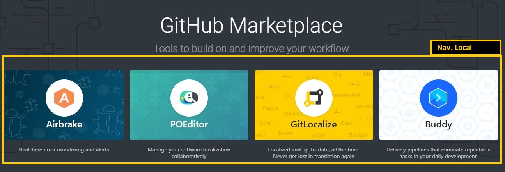

### Navegación Local Facetada
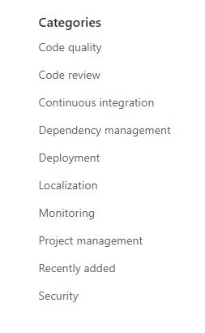

### Navegación Filtros
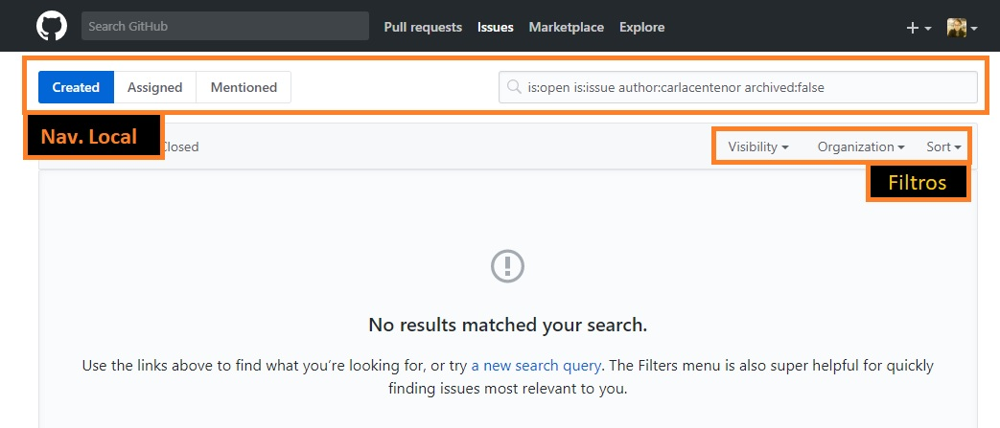

### Navegación Facetada
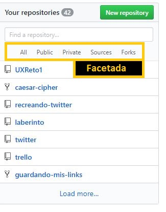

### Navegación Inline
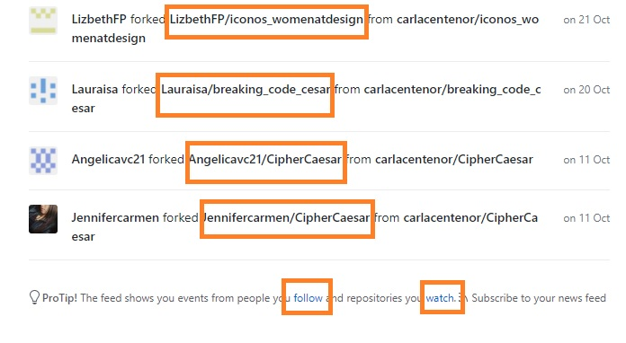

---
3. Identificando Elementos de Navegación de :
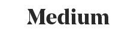

### Navegación Global
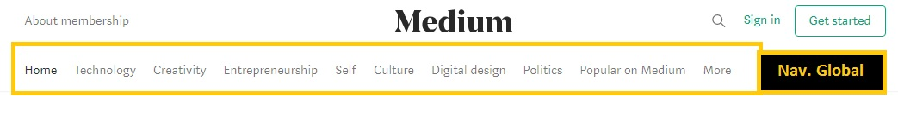
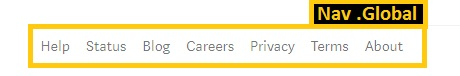

### Navegación Local
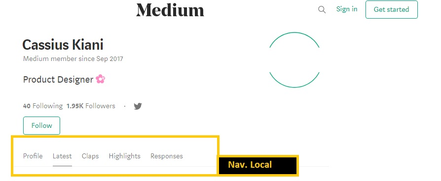
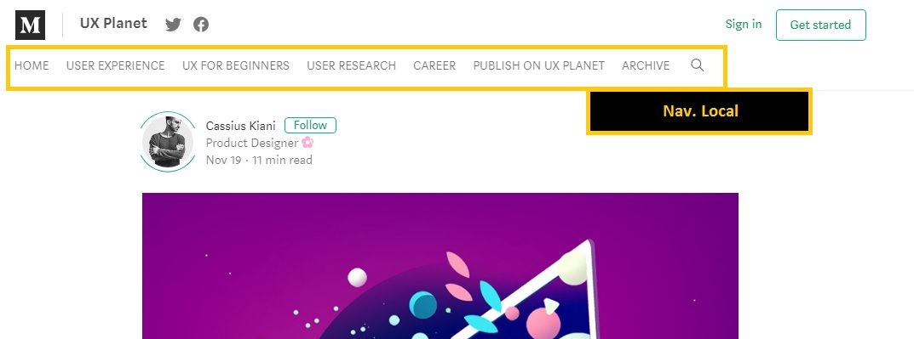

### Navegación Local Facetada
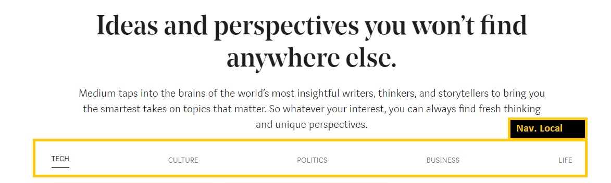
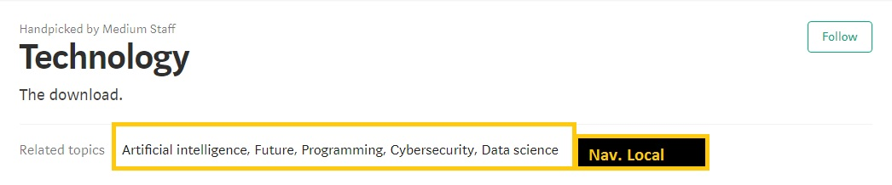

### Navegación Inline
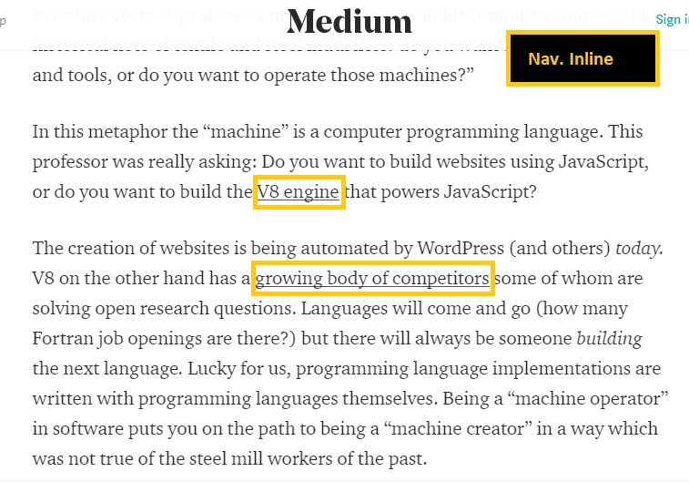

### Navegación Contextual

