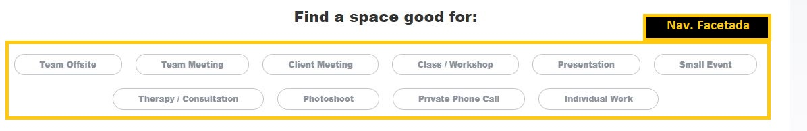
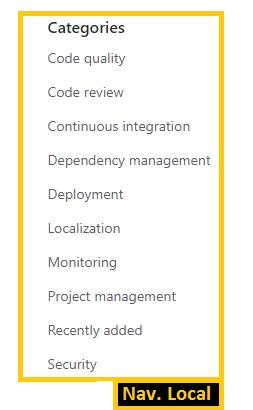
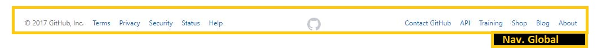
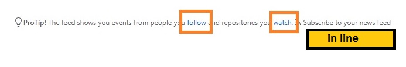

# Reto 2 UX 

## Objetivo
Identifica los elementos de navegación en los siguientes sites
* Breather
* Github
* Medium
---
Identificando Elementos de Navegación de :

###  Navegación Global

###  Navegación Facetada 

###  Navegación Filtrada

---
Identificando Elementos de Navegación de :

